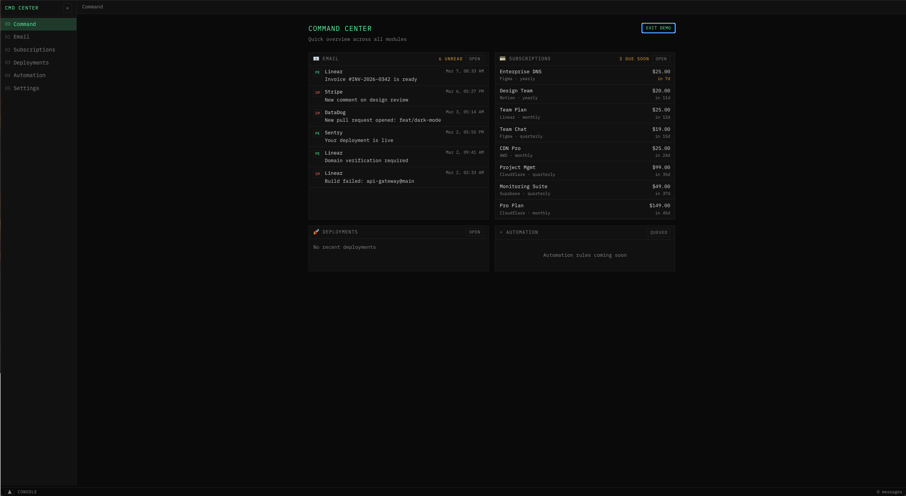
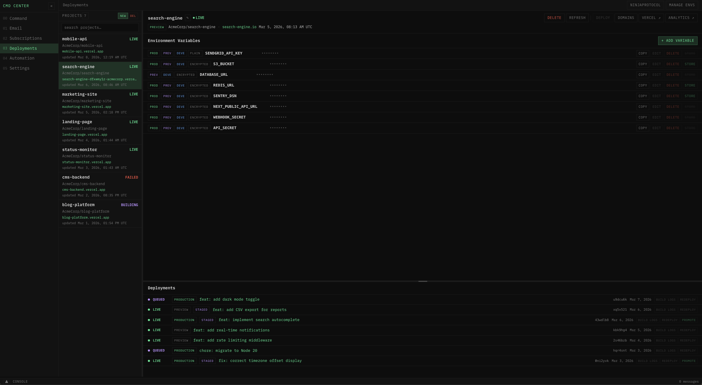
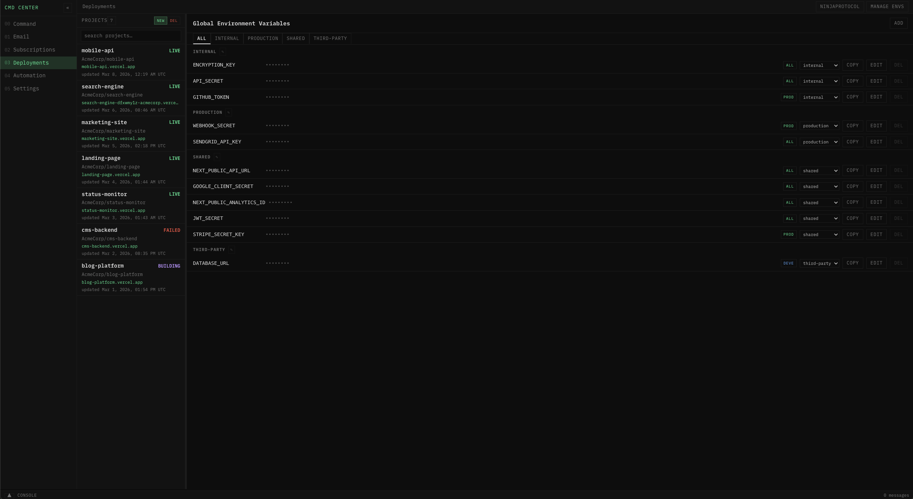
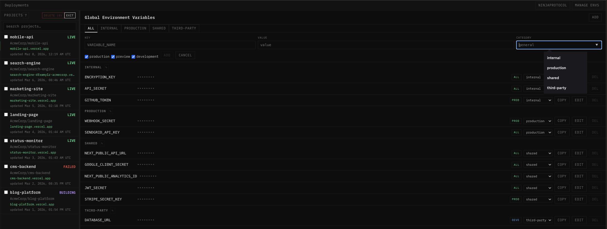
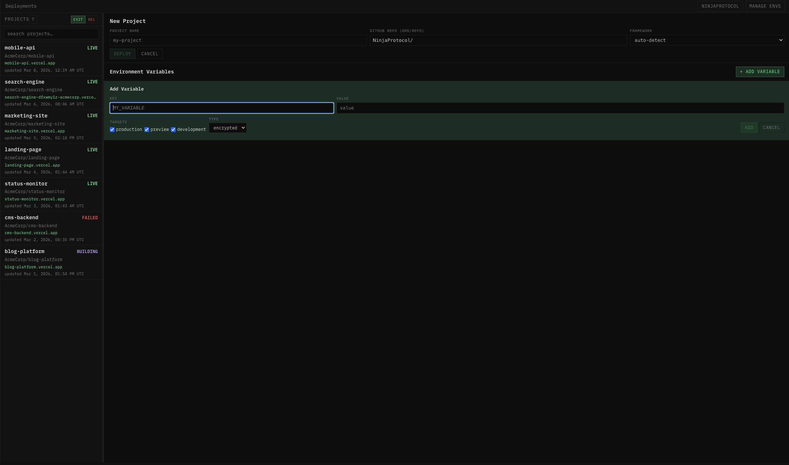
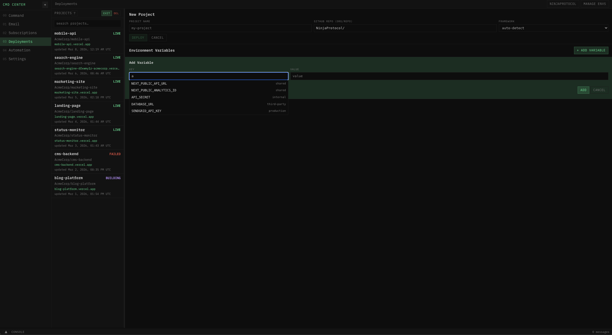

# Command Center — Deployments Module

An open-source, local-first command center dashboard with a modular architecture. This release includes the **Deployments** module for full Vercel project management — deployments, environment variables, and domains — all from a single local dashboard.

Command Center is designed as a **modular platform**. The base application ships with a shell, navigation, and dashboard overview. Each module is an independent feature set that plugs into the shell. This document provides the Deployments module. Additional modules (Email, Subscriptions, Automation, and more) will be released as separate instruction sets over time — same architecture, same shell, no rework required. Feel free to contribute module if you like the design.

---

## Quick Setup

1. Download the `/deployments/` folder from this repo
2. Give this folder as context to an AI agent and ask it to follow the instructions and build it
3. The agent will build the full application, then walk you through final setup:
   - It will ask you to create a Vercel API token (with a link and clear scope instructions)
   - It will offer to create the `.env.local` file and insert the token for you
   - It will ask about optional customizations (GitHub org name, default team)
4. Run the app

You do not need to set anything up beforehand — the agent handles everything after the build.

---

## Table of Contents

1. [How This Works](#how-this-works)
2. [Architecture Overview](#architecture-overview)
3. [Step 1: Scaffold the Application](#step-1-scaffold-the-application)
4. [Step 2: Build the Base Shell](#step-2-build-the-base-shell)
5. [Step 3: Build the Deployments Module](#step-3-build-the-deployments-module)
6. [Step 4: Configure and Run](#step-4-configure-and-run)
7. [Appendix A: Complete Type Definitions](#appendix-a-complete-type-definitions)
8. [Appendix B: Vercel API Endpoint Reference](#appendix-b-vercel-api-endpoint-reference)
9. [Appendix C: Implementation Notes & Edge Cases](#appendix-c-implementation-notes--edge-cases)

---

## How This Works

This document is a **complete specification** — it contains every detail needed to build the application from zero. You do not need to write any code yourself. The intended workflow is:

1. **You** hand this document to an AI coding agent (Copilot, Cursor, Windsurf, Cline, etc.)
2. **The agent** reads these instructions and builds the full application
3. **The agent** walks you through final setup — creating a Vercel API token, configuring the env file, and customizing the app for your org
4. **You** provide the token when prompted, and the agent sets everything up for you

The application is a Next.js web app that runs locally on your machine. It talks to Vercel's API through your personal token to manage your projects, deployments, environment variables, and domains — all from one dashboard.

### What You Get

- A full **Command Center shell** with navigation sidebar, topbar, and modular view system
- A **Command dashboard** (home page) with overview panels — Email, Subscriptions, and Deployments panels, Automation is a placeholder for future modules
- A complete **Deployments module** with:
  - Project list with search and bulk delete
  - One-click deploy, redeploy, promote, and rollback
  - Environment variable management with a reusable global template store
  - Domain management (assign, redirect, branch-pinning)
  - Build log viewing
  - Analytics status detection



### Modular Design

The shell is built so that future modules plug in without changing existing code. Each module is:
- A **navigation entry** in the sidebar
- A **component** that renders in the main area when its nav item is active
- An optional **topbar section** for module-specific controls
- A **card on the dashboard** for at-a-glance status

Today, only the Deployments module is functional. The navigation sidebar already includes placeholder entries for Email, Subscriptions, Automation, and Settings — these show a "module queued" message when clicked. As new module instruction sets are released, you follow the same workflow: hand the instructions to your agent, and it adds the module into your existing shell. You can also build out your own modules into this framework as you like.

---

## Architecture Overview

```
┌──────────────────────────────────────────────────────────────┐
│                        Browser (React)                       │
│                                                              │
│  ┌──────────────────────────────────────────────────────┐    │
│  │ CommandCenterShell                                   │    │
│  │  ├── Sidebar (navigation: Command, Deployments, ...) │    │
│  │  ├── Topbar (view label + module-specific controls)  │    │
│  │  └── Main Area                                       │    │
│  │      ├── CommandPage (dashboard overview)             │    │
│  │      │   └── Deployments card (recent deploys)        │    │
│  │      ├── DeploymentDashboard (full module)            │    │
│  │      └── [Future modules plug in here]                │    │
│  └──────────────────────────────────────────────────────┘    │
│                                                              │
└──────────────────┬───────────────────────────────────────────┘
                   │ fetch() to local Next.js API routes
                   ▼
┌──────────────────────────────────────────────────────────────┐
│                  Next.js API Routes (Server)                 │
│                                                              │
│   /api/vercel/teams             → list teams + personal acct  │
│   /api/vercel/projects          → list projects (GET)        │
│   /api/vercel/projects/action   → create, delete, rename     │
│   /api/vercel/env               → list, create, update, del  │
│   /api/vercel/deploy            → trigger new deployment     │
│   /api/vercel/deployments       → list, redeploy, promote,   │
│                                   build logs                 │
│   /api/vercel/domains           → list, add, remove          │
│   /api/vercel/globals           → local env template CRUD    │
│                                                              │
│   [Future modules add their own routes here]                 │
└──────────────┬───────────────┬───────────────────────────────┘
               │               │
               ▼               ▼
    ┌──────────────┐   ┌────────────────┐
    │ Vercel REST  │   │  Local File    │
    │     API      │   │  .env-store/   │
    │ api.vercel.  │   │  globals.json  │
    │     com      │   │                │
    └──────────────┘   └────────────────┘
```

**Key principle**: The browser never talks to external APIs directly. All API calls go through Next.js server routes which hold authentication tokens server-side. This keeps your secrets safe.

---

## Step 1: Scaffold the Application

### Technology Stack

| Technology | Purpose |
|---|---|
| Next.js (latest) | App Router, API routes, server-side rendering |
| React (latest) | UI components |
| TypeScript | Type safety |
| Tailwind CSS | Base styling reset |

The agent should scaffold a new Next.js application with TypeScript, App Router, Tailwind CSS, and ESLint. Use npm as the package manager.

### Fonts

The application uses **IBM Plex Mono** (weights: 400, 500, 600) and **IBM Plex Sans** (weights: 400, 500, 600, 700) via `next/font/google`. The CSS variables are `--font-plex-mono` and `--font-plex-sans`. Apply both font variables to the `<body>` element.

### Root Layout

The root layout wraps all content in a `ToastProvider` component (described below). The page title is "Command Center".

### Root Page

The root page renders a single component: `<CommandCenterShell />`.

### File Structure

This is the target file structure. The agent should create all of these files:

```
src/
├── app/
│   ├── globals.css                      # All styles and CSS variables
│   ├── layout.tsx                       # Root layout with fonts + ToastProvider
│   ├── page.tsx                         # Renders CommandCenterShell
│   └── api/
│       └── vercel/
│           ├── projects/
│           │   ├── route.ts             # GET: list projects
│           │   └── action/
│           │       └── route.ts         # POST: create, delete, rename
│           ├── env/
│           │   └── route.ts             # GET: list | POST: create, update, delete
│           ├── deploy/
│           │   └── route.ts             # POST: trigger deployment
│           ├── deployments/
│           │   └── route.ts             # GET: list | POST: redeploy, promote, logs
│           ├── domains/
│           │   └── route.ts             # GET: list | POST: add, remove
│           ├── globals/
│           │   └── route.ts             # GET: list | POST: create, update, delete
│           └── teams/
│               └── route.ts             # GET: list teams + personal account
├── components/
│   ├── toast-provider.tsx               # Toast notification system
│   ├── command-center-shell.tsx         # App shell (sidebar, topbar, routing)
│   ├── command-page.tsx                 # Dashboard overview page
│   └── deployment-dashboard.tsx         # Full Deployments module UI
└── lib/
    ├── dashboard-data.ts                # Navigation items and shared types
    ├── vercel-types.ts                  # All Vercel type definitions
    ├── vercel-service.ts                # Vercel API client (server-side only)
    └── env-store.ts                     # Local file-based env template store
```

---

## Step 2: Build the Base Shell

The base shell is the foundation that all modules share. It provides navigation, layout, and the dashboard overview.

### 2.1 Styling System (globals.css)

All styling uses CSS custom properties and global utility classes. No component-level CSS modules — components use these classes plus inline styles.

#### CSS Variables

```css
:root {
  --bg: #0a0a0a;
  --fg: #c8c8c8;
  --fg-bright: #e0e0e0;
  --border: #1e1e1e;
  --surface: #111111;
  --surface-raised: rgba(17, 17, 17, 0.96);
  --muted: #808080;
  --muted-dim: #585858;
  --accent: #5af0a0;
  --accent-dim: rgba(90, 240, 160, 0.15);
  --warn: #e0a040;
  --danger: #f05050;
  --log-info: #6cb6ff;
  --log-success: #5af0a0;
  --log-warn: #e0a040;
  --log-error: #f05050;
  --log-sync: #c49bff;
  --log-dim: #808080;
}
```

Additionally, include Tailwind's theme integration:
```css
@import "tailwindcss";

@theme inline {
  --color-background: var(--bg);
  --color-foreground: var(--fg);
  --font-sans: var(--font-plex-sans);
  --font-mono: var(--font-plex-mono);
}
```

#### Base Styles

```css
* { box-sizing: border-box; margin: 0; padding: 0; }

html, body {
  height: 100%;
  overflow: hidden;
  background: var(--bg);
  color: var(--fg);
  font-family: var(--font-plex-mono), monospace;
  font-size: 14px;
  line-height: 1.55;
}

a { color: var(--accent); text-decoration: none; }
a:hover { text-decoration: underline; }
::selection { background: rgba(90, 240, 160, 0.2); }
```

#### Layout Classes

```css
.cc-shell { display: flex; flex-direction: column; height: 100vh; }
.cc-layout-row { display: flex; flex: 1; min-height: 0; overflow: hidden; }
.cc-sidebar {
  width: 200px; min-width: 200px; background: var(--surface);
  border-right: 1px solid var(--border); display: flex;
  flex-direction: column; overflow: hidden;
}
.cc-sidebar.collapsed { width: 44px; min-width: 44px; }
.cc-main { flex: 1; min-width: 0; min-height: 0; display: flex; flex-direction: column; overflow: hidden; }
.cc-topbar {
  height: 36px; min-height: 36px; background: var(--surface);
  border-bottom: 1px solid var(--border); display: flex;
  align-items: center; padding: 0 14px; gap: 10px; font-size: 13px;
}
.cc-body { flex: 1; min-height: 0; overflow: hidden; display: flex; }
```

#### Navigation Classes

```css
.cc-nav-item {
  display: flex; align-items: center; gap: 8px; padding: 6px 12px;
  font-size: 14px; color: var(--muted); cursor: pointer; border: none;
  background: none; width: 100%; text-align: left;
  font-family: var(--font-plex-mono), monospace;
}
.cc-nav-item:hover { color: var(--fg); background: rgba(255,255,255,0.03); }
.cc-nav-item.active { color: var(--accent); background: var(--accent-dim); }
```

#### Panel, Row, Badge and Button Classes

```css
/* Panels */
.cc-panel {
  background: var(--surface); border: 1px solid var(--border);
  overflow: hidden; display: flex; flex-direction: column;
}
.cc-panel-header {
  padding: 6px 12px; border-bottom: 1px solid var(--border);
  font-size: 12px; text-transform: uppercase; letter-spacing: 0.1em;
  color: var(--muted); display: flex; align-items: center;
  justify-content: space-between; min-height: 32px;
}
.cc-panel-body { flex: 1; overflow-y: auto; overflow-x: hidden; }

/* Rows */
.cc-row {
  padding: 6px 12px; border-bottom: 1px solid var(--border);
  cursor: pointer; font-size: 14px; display: flex;
  align-items: flex-start; gap: 8px;
}
.cc-row:hover { background: rgba(255,255,255,0.02); }
.cc-row.selected { background: var(--accent-dim); }

/* Badges */
.cc-badge {
  font-size: 11px; text-transform: uppercase; letter-spacing: 0.08em;
  padding: 2px 6px; border: 1px solid var(--border); color: var(--muted);
}

/* Buttons */
.cc-btn {
  font-family: var(--font-plex-mono), monospace; font-size: 12px;
  text-transform: uppercase; letter-spacing: 0.06em; padding: 4px 10px;
  border: 1px solid var(--border); background: transparent;
  color: var(--muted); cursor: pointer;
}
.cc-btn:hover { color: var(--fg); background: rgba(255,255,255,0.04); }
.cc-btn.primary { color: var(--accent); border-color: rgba(90,240,160,0.3); background: var(--accent-dim); }
.cc-btn.primary:hover { background: rgba(90,240,160,0.22); }
.cc-btn:disabled { opacity: 0.4; cursor: default; }

/* Forms */
.cc-label {
  display: block; font-size: 10px; text-transform: uppercase;
  letter-spacing: 0.08em; color: var(--muted); margin-bottom: 3px;
}
.cc-input, .cc-textarea, select.cc-input {
  width: 100%; border: 1px solid var(--border); background: var(--bg);
  color: var(--fg); padding: 4px 8px;
  font-family: var(--font-plex-mono), monospace; font-size: 13px;
}
.cc-input::placeholder, .cc-textarea::placeholder { color: var(--muted); }

/* Error display */
.cc-error {
  font-size: 13px; padding: 5px 14px;
  border: 1px solid rgba(224,160,64,0.2);
  background: rgba(224,160,64,0.12); color: var(--warn);
}
```

#### Toast Styles

```css
.cc-toast-stack {
  position: fixed; right: 18px; bottom: 18px; z-index: 2000;
  display: flex; flex-direction: column; align-items: flex-end;
  gap: 10px; pointer-events: none;
}
.cc-toast {
  min-width: 280px; max-width: min(360px, calc(100vw - 36px));
  padding: 12px 14px; border: 1px solid var(--border);
  background: var(--surface-raised);
  box-shadow: 0 10px 30px rgba(0, 0, 0, 0.45);
  color: var(--fg-bright); display: flex; flex-direction: column;
  gap: 3px; text-align: left; cursor: pointer; pointer-events: auto;
  opacity: 0; transform: translateY(10px);
  animation: cc-toast-enter 2s ease forwards;
}
.cc-toast-success { border-color: rgba(90, 240, 160, 0.28); }
.cc-toast-error   { border-color: rgba(240, 80, 80, 0.32); }
.cc-toast-info    { border-color: rgba(108, 182, 255, 0.28); }
.cc-toast-title {
  font-size: 12px; text-transform: uppercase; letter-spacing: 0.08em;
}
.cc-toast-description {
  font-size: 12px; color: var(--muted); text-transform: none;
  letter-spacing: 0; line-height: 1.4;
}
@keyframes cc-toast-enter {
  0%   { opacity: 0; transform: translateY(10px); }
  12%  { opacity: 1; transform: translateY(0); }
  82%  { opacity: 1; transform: translateY(0); }
  100% { opacity: 0; transform: translateY(6px); }
}
```

#### Scrollbar Styles

```css
::-webkit-scrollbar { width: 8px; height: 8px; }
::-webkit-scrollbar-track { background: transparent; }
::-webkit-scrollbar-thumb { background: rgba(255,255,255,0.1); }
::-webkit-scrollbar-thumb:hover { background: rgba(255,255,255,0.18); }
```

#### Additional Utility Classes

```css
/* Active button variant (used on domain toggle, etc.) */
.cc-btn.active { color: var(--accent); border-color: rgba(90,240,160,0.3); }

/* Textarea */
.cc-textarea { min-height: 100px; resize: vertical; }

/* Resize handle (used between env and deployment panes) */
.cc-resize-handle {
  height: 5px; min-height: 5px; cursor: row-resize;
  background: var(--border); position: relative;
}
.cc-resize-handle:hover,
.cc-resize-handle.dragging {
  background: var(--accent); opacity: 0.6;
}
```

### 2.2 Toast Provider

A React context provider that manages toast notifications. The entire application is wrapped in this provider.

**Interface**:
```typescript
type ToastInput = { title: string; description?: string; variant?: "success" | "error" | "info" };
```

**Behavior**:
- `showToast(toast)` creates a notification that auto-dismisses after 2 seconds
- Each toast has a unique ID (`Date.now() + random`)
- Toasts are stacked in the bottom-right corner (fixed position)
- Maximum 4 toasts visible at once (oldest are dropped)
- Clicking a toast dismisses it immediately
- Toast elements animate in and fade out using the `cc-toast-enter` keyframe
- Variant sets the border color: success (green), error (red), info (blue)

**`useToast()` hook**: Returns `{ showToast }` from context. Throws if used outside provider.

### 2.3 Navigation Data (dashboard-data.ts)

```typescript
type NavItem = {
  id: string;
  label: string;
  shortLabel: string;  // Two-digit index: "00", "01", etc.
  status: string;      // "live shell" or "queued"
  description: string;
};

const navItems: NavItem[] = [
  { id: "command",       label: "Command",       shortLabel: "00", status: "live shell", description: "Dashboard overview with quick-glance panels for every module." },
  { id: "email",         label: "Email",         shortLabel: "01", status: "live shell", description: "Unified inbox, account switching, and classic mailbox actions." },
  { id: "subscriptions", label: "Subscriptions", shortLabel: "02", status: "live shell", description: "Recurring bills, due payments, and domain expiration tracking." },
  { id: "deployments",   label: "Deployments",   shortLabel: "03", status: "live shell", description: "Vercel project management, deployments, and environment variables." },
  { id: "automation",    label: "Automation",     shortLabel: "04", status: "queued",     description: "Scheduled sync jobs, inbox rules, and repo routines." },
  { id: "settings",      label: "Settings",       shortLabel: "05", status: "queued",     description: "Credentials, encryption, provider connections, and local storage." },
];
```

Note: "command", "email", "subscriptions", and "deployments" are functional. The remaining entries display a placeholder message when selected: `"{label} module queued."` This allows future modules to be added by simply changing their status and pointing to a new component.

### 2.4 Command Center Shell

The shell is the root `"use client"` component that provides the full-page layout with sidebar navigation, topbar, and content routing.

#### Layout Structure

```
┌──────────────────────────────────────────────────────────────┐
│ cc-shell (full viewport height)                              │
│ ┌────────────────────────────────────────────────────────┐   │
│ │ cc-layout-row                                          │   │
│ │ ┌──────────┬───────────────────────────────────────┐   │   │
│ │ │          │ cc-main                               │   │   │
│ │ │ cc-      │ ┌─────────────────────────────────┐   │   │   │
│ │ │ sidebar  │ │ cc-topbar                       │   │   │   │
│ │ │          │ ├─────────────────────────────────┤   │   │   │
│ │ │ CMD CTR  │ │                                 │   │   │   │
│ │ │ ──────── │ │ cc-body                         │   │   │   │
│ │ │ 00 Cmd   │ │ (active module renders here)    │   │   │   │
│ │ │ 01 Email │ │                                 │   │   │   │
│ │ │ 02 Subs  │ │                                 │   │   │   │
│ │ │ 03 Deploy│ │                                 │   │   │   │
│ │ │ 04 Auto  │ │                                 │   │   │   │
│ │ │ 05 Sets  │ │                                 │   │   │   │
│ │ └──────────┴─┴─────────────────────────────────┘   │   │   │
│ └────────────────────────────────────────────────────────┘   │
└──────────────────────────────────────────────────────────────┘
```

#### Shell State

```typescript
const [collapsed, setCollapsed] = useState(false);       // Sidebar collapsed
const [view, setView] = useState("command");             // Active view ID
const [envManageOpen, setEnvManageOpen] = useState(false); // Global env management toggle
```

#### Sidebar

- **Header**: Shows "CMD CENTER" text (accent color, uppercase, letter-spacing 0.08em) and a collapse toggle button (`«` / `»`). When collapsed, only the toggle button is visible.
- **Navigation**: Renders all `navItems` as buttons. Each button shows the `shortLabel` (dimmed, 12px) and `label` (hidden when collapsed). Active item uses the `.active` class.

#### Topbar

- Shows the active view's label on the left in muted color
- When the deployments view is active, shows two action buttons on the right:
  1. **Team Switcher** — A dropdown button showing the active workspace name. The personal workspace uses the Vercel workspace label (for example `adidogCEO's projects`) rather than a duplicate generic `Personal` entry. Clicking opens a dropdown with the named personal workspace plus the remaining teams. Items show a ✓ checkmark next to the active selection. Selecting a workspace sets `activeTeamId` state, which is passed to `<DeploymentDashboard>` and `<CommandPage>` causing them to re-fetch for the new scope. Clicking outside closes the dropdown.
  2. **MANAGE ENVS** — Toggles `envManageOpen` state.

#### Team State

```typescript
const [teams, setTeams] = useState<VercelTeam[]>([]);
const [personalAccountId, setPersonalAccountId] = useState<string | null>(null);
const [personalLabel, setPersonalLabel] = useState("Personal");
const [activeTeamId, setActiveTeamId] = useState<string | undefined>(undefined);
const [teamDropdownOpen, setTeamDropdownOpen] = useState(false);
const teamDropdownRef = useRef<HTMLDivElement | null>(null);
```

On mount, the shell fetches `/api/vercel/teams` to populate the team list, the personal account ID, and the named personal workspace label (`personalLabel`). The backend calls `getCurrentUserProfile()` to find the user's `defaultTeamId`, locates that workspace in the teams list, removes it from the regular team array (to prevent duplicate entries), and returns the workspace name as `personalLabel`. The shell stores this label and uses it for the personal entry in the dropdown (for example `adidogCEO's projects` instead of a generic `Personal`). The default `activeTeamId` is set by checking `NEXT_PUBLIC_VERCEL_TEAM_ID` against the returned team list — if a match is found, that team is selected. Otherwise, the first remaining team is used, or the state is left `undefined` for the personal workspace. A click-outside `useEffect` closes the dropdown when the user clicks elsewhere.

- `activeTeamId === "personal"` → personal account (sends `teamId=personal` to API routes, which `resolveTeamId` treats as explicitly no team)
- `activeTeamId === undefined` → initial state before teams load (falls back to `VERCEL_TEAM_ID` env var)
- `activeTeamId === "team_xxx"` → team-scoped API calls

#### Content Routing (cc-body)

The main area renders content based on the active view. The shell derives `activeNav` from the current `view` state via `navItems.find(n => n.id === view)` and routes on `activeNav.id`. Each live module gets its own branch; queued modules fall through to a placeholder:

```tsx
{activeNav.id === commandView ? (
  <CommandPage onNavigate={setView} teamId={activeTeamId} />
) : activeNav.id === emailView ? (
  /* Email module UI — documented separately */
) : activeNav.id === subscriptionsView ? (
  /* Subscriptions module UI — documented separately */
) : activeNav.id === deploymentView ? (
  <DeploymentDashboard
    envManageOpen={envManageOpen}
    onToggleEnvManage={() => setEnvManageOpen((v) => !v)}
    teamId={activeTeamId}
  />
) : (
  <div style={{ flex: 1, display: "flex", alignItems: "center", justifyContent: "center", color: "var(--muted)" }}>
    {activeNav.label} module queued.
  </div>
)}
```

The view ID constants (e.g. `const commandView = "command"`, `const deploymentView = "deployments"`) are defined at the top of the component for readability. The email and subscriptions branches are live modules documented in their own instruction sets — they follow the same routing pattern. The placeholder for queued modules is a centered muted message.

### 2.5 Command Page (Dashboard Overview)

The command page is the landing view (`view === "command"`). It shows a grid of summary panels — one per module. This gives users a quick glance across everything.

#### Props

```typescript
type CommandPageProps = { onNavigate: (view: string) => void; teamId?: string };
```

The `onNavigate` callback allows panels to have an "open" button that switches to the full module view. The `teamId` scopes the deployments summary fetch to the active team — when it changes, the component re-fetches.

#### Layout

```
┌───────────────────────────────────────────┐
│  COMMAND CENTER                           │
│  Quick overview across all modules        │
│                                           │
│  ┌──────────────┐  ┌──────────────┐       │
│  │ � email     │  │ 💳 subs      │       │
│  │  [live data]  │  │  [live data]  │       │
│  └──────────────┘  └──────────────┘       │
│  ┌──────────────┐  ┌──────────────┐       │
│  │ 🚀 deploys   │  │ ⚡ auto      │       │
│  │  [live data]  │  │  [queued]    │       │
│  └──────────────┘  └──────────────┘       │
└───────────────────────────────────────────┘
```

- Scrollable container with 24px padding
- Max width: 960px, centered
- Header: "Command Center" (18px, accent color, uppercase) with subtitle "Quick overview across all modules"
- Grid: 2 columns, 16px gap

#### Email Panel (Live)

Fetches from `/api/mail/inbox?folder=INBOX&limit=8` for unread emails.

**Header**: "📧 email" with unread count badge (yellow `--warn`) and an "open" button that calls `onNavigate("email")`.

**Each row shows**:
- **Provider badge** (10px, border badge): "PE" for PrivateEmail (green), "GM" for Gmail (red), "??" for unknown
- **Sender name** (13px, bright, ellipsis) + **Timestamp** (11px, muted, right-aligned) on the first line
- **Subject line** (13px, default text color, ellipsis) on the second line

Empty state: "No unread emails" (muted). Loading state: "loading…" (muted).

Min height: 200px.

#### Subscriptions Panel (Live)

Reads active billing entries from `localStorage` under key `command-center.billing-tracker`, sorted by due date, limited to 6.

**Header**: "💳 subscriptions" with "due soon" count badge (yellow `--warn`, counts bills due within 14 days) and an "open" button that calls `onNavigate("subscriptions")`.

**Each row shows**:
- **Bill name** (13px, bright, ellipsis) + **Vendor · cadence** (11px, muted)
- **Amount** in USD (13px, right-aligned) + **Due label** (11px): "Xd overdue" (red `--danger`), "due today" / "in Xd" within 7 days (yellow `--warn`), or "in Xd" beyond 7 days (muted)

Empty state: "No active bills" (muted).

Min height: 200px.

#### Deployments Panel (Live)

Fetches from `/api/vercel/deployments?limit=10` (no `projectId` — returns all team deployments). Uses request invalidation via `deploymentRequestRef` to discard stale responses on scope switches.

**Header**: "🚀 deployments" with an "open" button that calls `onNavigate("deployments")`.

**Each row shows**:
- **State label** (10px, bold, fixed 32px width): "LIVE" (green), "FAIL" (red), "BUILD" (yellow `--warn`), "QUEUE" (muted), or raw state
- **Project name** (12px, bright, max 100px, ellipsis)
- **Commit message** or deployment URL (12px, default text color, fills remaining space, ellipsis)
- **Timestamp** (11px, muted, right-aligned) — formatted as "Jan 15, 03:42 PM"

State color mapping:
- `READY` → `var(--log-success)` (green)
- `ERROR` → `var(--log-error)` (red)
- `BUILDING` → `var(--warn)` (amber)
- Anything else → `var(--muted)`

Min height: 120px.

#### Automation Panel (Placeholder)

**Header**: "⚡ automation", badge "queued" in header. Body: "Automation rules coming soon" (centered, muted text).

Min height: 120px.

---

## Step 3: Build the Deployments Module

This is the core module. It is a large component (~2500 lines) that provides full Vercel project management.

### 3.1 Type System (vercel-types.ts)

All types live in a single file. These represent the mapped/normalized data your application works with — not raw Vercel API responses.

#### VercelProject

```typescript
type VercelProject = {
  id: string;
  name: string;
  framework: string | null;      // "nextjs", "vite", "remix", etc.
  createdAt: number;              // Unix timestamp in ms
  updatedAt: number;
  vercelScope: string | null;    // Team/account scope inferred from deployment hostnames
  dashboardUrl: string | null;   // Direct link to project in Vercel dashboard
  latestDeployments?: VercelDeploymentSummary[];  // Up to 3 most recent
  link?: {
    type: string;                 // "github"
    repo: string;                 // "my-repo"
    repoId: number;               // GitHub numeric repo ID (critical for deployments)
    org: string;                  // "MyOrg"
    productionBranch?: string;    // "main", "master", etc.
  };
  webAnalytics?: { id: string; enabledAt?: number; hasData?: boolean };
  speedInsights?: { id: string; hasData?: boolean };
};
```

**Key details**:
- `vercelScope` is inferred at map time from `.vercel.app` deployment hostnames (e.g. `myproject-nproto.vercel.app` → scope is `nproto`). Used to construct the dashboard URL without relying on GitHub org data.
- `dashboardUrl` is `https://vercel.com/{scope}/{projectName}` when scope is available, otherwise `null`. Enables the "VERCEL ↗" header button.
- `latestDeployments` comes from the Vercel project list API — each project includes its 3 most recent deployments, used for sidebar status indicators without extra API calls.
- `link.repoId` is the GitHub numeric repo ID required to trigger Git-based deployments.
- `webAnalytics.enabledAt` — when present, analytics is enabled. Used to highlight the analytics button green.

#### VercelDeploymentSummary

```typescript
type VercelDeploymentSummary = {
  id: string;
  url: string;
  state: string;           // "READY", "ERROR", "BUILDING", "QUEUED", "CANCELED"
  createdAt: number;
  target: string | null;   // "production" or null (preview)
  aliases: string[];       // Custom domain aliases
};
```

A lightweight type embedded in project data. Not the same as the full deployment type.

#### VercelDeployment

```typescript
type VercelDeployment = {
  uid: string;
  name: string;                 // Project name
  url: string;                  // Deployment URL (no protocol)
  state: string;                // Normalized: "READY", "ERROR", "BUILDING", etc.
  readySubstate: string | null; // "PROMOTED" when explicitly promoted
  target: string | null;        // "production" or null
  createdAt: number;
  buildingAt: number | null;
  ready: number | null;
  inspectorUrl: string;         // Link to Vercel deployment inspector
  isRollbackCandidate: boolean;
  meta: {
    githubCommitMessage: string | null;
    githubCommitRef: string | null;
    githubCommitSha: string | null;
    githubCommitAuthorLogin: string | null;
    githubRepoId: string | null;
  };
};
```

**Key details**:
- `state` is normalized from either `readyState` or `state` in Vercel's API response (they use both fields depending on deployment age).
- `readySubstate === "PROMOTED"` means explicitly promoted — controls rollback button visibility.
- `isRollbackCandidate` from Vercel indicates deployment eligibility for rollback.

#### VercelEnvVariable

```typescript
type VercelEnvVariable = {
  id: string;
  key: string;
  value: string;
  target: string[];     // ["production", "preview", "development"]
  type: "system" | "encrypted" | "plain" | "secret" | "sensitive";
  configurationId: string | null;
  contentHint?: { type: string; integrationId?: string };
  createdAt: number;
  updatedAt: number;
};
```

**Key details**:
- `contentHint` is present on integration-managed (locked) variables. When present, the variable is displayed at reduced opacity with edit/delete buttons hidden and a "locked" badge shown.
- The UI sorts variables with `contentHint` to the bottom.

#### VercelDomain

```typescript
type VercelDomain = {
  name: string;
  apexName: string;
  projectId: string;
  redirect: string | null;
  redirectStatusCode: number | null;  // 301, 302, 307, 308
  gitBranch: string | null;
  customEnvironmentId: string | null;
  verified: boolean;
  createdAt: number;
  updatedAt: number;
};
```

#### Response & Result Types

```typescript
type VercelProjectListResponse = { projects: VercelProject[]; error?: string };
type VercelEnvListResponse     = { envs: VercelEnvVariable[]; error?: string };
type VercelDomainListResponse  = { domains: VercelDomain[];   error?: string };
type VercelDeploymentListResponse = { deployments: VercelDeployment[]; error?: string };
type VercelActionResult = { ok: boolean; error?: string };
type VercelCreateResult = { ok: boolean; project?: VercelProject; error?: string };
```

All API routes return these standardized shapes. The frontend checks `error` on list responses and `ok` on mutation responses.

#### VercelTeam

```typescript
type VercelTeam = {
  id: string;
  slug: string;
  name: string;
  avatar: string | null;
  membership: { role: string };
};

type VercelTeamListResponse = {
  teams: VercelTeam[];
  personalId: string | null;
  personalTeamId?: string | null;
  personalLabel?: string | null;
  error?: string;
};
```

Used by the team switcher. `personalId` is the user's personal account ID (from `/v2/user`), returned alongside the team list so the shell can offer a "Personal" option.

### 3.2 Service Layer (vercel-service.ts)

Server-side module wrapping all Vercel REST API calls. Must only be imported in server code (API routes), never in `"use client"` components.

#### Internal Helpers

**`vercelFetch(path, init?)`** — Wrapper around `fetch()` that:
- Prepends the base URL `https://api.vercel.com`
- Adds `Authorization: Bearer <token>` and `Content-Type: application/json` headers
- Returns the raw `Response` object

**`extractError(body, status)`** — Error extraction handling two Vercel error formats:
- `{ error: { message: "..." } }` — standard format
- `{ message: "..." }` — alternative format
- Falls back to `"HTTP <status>"` if neither exists

**`getToken()`** — Reads `VERCEL_TOKEN` from `process.env`. Throws if not set.

**`getTeamId()`** — Reads `VERCEL_TEAM_ID` from `process.env`. Returns `undefined` if not set.

**`resolveTeamId(override?)`** — Returns the `override` if provided, otherwise falls back to `getTeamId()`. Special case: if `override` is `"personal"`, returns `undefined` (no team) — this ensures the personal account selection bypasses the env variable fallback. This allows runtime team switching: the shell passes a `teamId` from its state, which overrides the env variable.

**`teamQuery(override?)`** — Returns `teamId=<id>` query string using `resolveTeamId(override)`, or empty string. Appended to all API calls.

**`getCurrentUser()`** — Calls `/v2/user` and returns `{ id, username }`. Returns nulls on failure.

**`getCurrentUserProfile()`** — Calls `/v2/user` and returns `{ id, username, name, defaultTeamId }`. The `defaultTeamId` field identifies the user's personal Vercel workspace, which Vercel models as a team internally. Used by `listTeams()` to find and remove the personal workspace from the regular team list, and by `listProjects()` to resolve the correct scope when `teamId === "personal"`. Returns nulls on failure.

**All exported service functions** accept an optional trailing `teamId?: string` parameter. When provided, it overrides the env-configured team. When omitted, falls back to `VERCEL_TEAM_ID` or no team (personal account).

#### Team Operations

| Function | Vercel Endpoint | Method | Notes |
|---|---|---|---|
| `listTeams()` | `/v2/teams?limit=100` + `/v2/user` | GET | Fetches all teams, then calls `getCurrentUserProfile()` to get `defaultTeamId`. If `defaultTeamId` matches one of the returned teams, that team is the personal workspace — it is removed from the `teams` array and its `id` is returned as `personalTeamId`. The `personalLabel` is the workspace name, falling back to `"{name}'s projects"` or `"{username}'s projects"`. This deduplication prevents the personal workspace from appearing twice in the selector (once as a team entry and once as the dedicated personal slot). Returns `{ teams, personalId, personalTeamId, personalLabel }`. |

#### Project Operations

| Function | Vercel Endpoint | Method | Notes |
|---|---|---|---|
| `listProjects()` | `/v10/projects?limit=100` | GET | Response includes `latestDeployments` per project. When `teamId === "personal"`, the service calls `getCurrentUserProfile()` to get the real `defaultTeamId`, then queries `/v10/projects?teamId={defaultTeamId}` to fetch personal projects under their actual Vercel scope. If `defaultTeamId` cannot be resolved (e.g. token lacks personal scope access), returns `{ projects: [], error: "Unable to resolve the personal Vercel scope for this token." }`. For team scopes, passes `teamId` through `teamQuery()` normally. |
| `createProject(name, repo, framework?)` | `/v10/projects` | POST | Body: `{ name, gitRepository: { type: "github", repo }, framework? }`. Returns the created project via `VercelCreateResult`. |
| `deleteProject(projectId)` | `/v9/projects/{id}` | DELETE | — |
| `renameProject(projectId, newName)` | `/v9/projects/{id}` | PATCH | Body: `{ name: newName }` |

#### Environment Variable Operations

| Function | Vercel Endpoint | Method | Notes |
|---|---|---|---|
| `listEnvVariables(projectId)` | `/v10/projects/{id}/env?decrypt=true` | GET | `decrypt=true` returns actual values instead of empty strings for encrypted vars. |
| `createEnvVariable(projectId, key, value, target, type)` | `/v10/projects/{id}/env` | POST | `target` is an array like `["production", "preview"]`. `type` is typically `"encrypted"`. |
| `updateEnvVariable(projectId, envId, key, value, target, type)` | `/v9/projects/{id}/env/{envId}` | PATCH | Full replacement — all fields must be provided. |
| `deleteEnvVariable(projectId, envId)` | `/v9/projects/{id}/env/{envId}` | DELETE | — |

#### Deployment Operations

| Function | Endpoint | Method | Notes |
|---|---|---|---|
| `deployProject(projectName, repoId, ref)` | `/v13/deployments?forceNew=1` | POST | Body: `{ name, target: "production", gitSource: { type: "github", repoId, ref } }`. `forceNew=1` forces a new build. |
| `listDeployments(projectId?, limit?)` | `/v6/deployments` | GET | `projectId` is optional — without it, returns all team deployments. Default limit: 20. |
| `redeployDeployment(projectName, repoId, ref, sha)` | `/v13/deployments?forceNew=1` | POST | Same as deploy but adds `sha` to `gitSource` to pin the exact commit. |
| `promoteDeployment(projectId, deploymentId)` | `/v10/projects/{id}/promote/{deploymentId}` | POST | Returns 409 if already current production. Returns empty body on 200 (success). |
| `getDeploymentLogs(deploymentId)` | `/v3/deployments/{id}/events` | GET | Returns NDJSON array of `{ text: string }`. Concatenate all `text` fields with newlines. |

#### Domain Operations

| Function | Endpoint | Method | Notes |
|---|---|---|---|
| `listDomains(projectId)` | `/v9/projects/{id}/domains` | GET | — |
| `addDomain(projectId, name, options?)` | `/v10/projects/{id}/domains` | POST | Options: `{ redirect?, redirectStatusCode?, gitBranch? }`. |
| `removeDomain(projectId, domain)` | `/v9/projects/{id}/domains/{domain}` | DELETE | — |

#### Data Mappers

The service includes mapper functions that normalize Vercel's raw API responses:

- **`mapProject(raw)`** — Slices `latestDeployments` to 3. Maps `link` (GitHub connection), `webAnalytics`, and `speedInsights` using `mapAnalyticsBlock`. Calls `inferVercelScope` to populate `vercelScope` and constructs `dashboardUrl` as `https://vercel.com/{scope}/{name}`.
- **`mapDeployment(raw)`** — Normalizes state: uses `readyState || state`. Extracts `meta` fields for git info.
- **`mapDomain(raw)`** — Direct field mapping with null coalesce defaults.
- **`mapEnv(raw)`** — Preserves `contentHint` for locked detection.
- **`mapAnalyticsBlock(raw)`** — Converts analytics sub-object or returns `undefined`.

#### Scope Inference Helpers

**`extractHostname(value)`** — Parses a URL or bare hostname string and returns the lowercase hostname. Handles values with or without protocol prefix.

**`inferVercelScope(raw, projectName)`** — Infers the Vercel account/team scope from deployment hostnames. The algorithm:
1. Collects all URLs and aliases from the project's `latestDeployments`
2. Filters for `.vercel.app` hostnames
3. First pass: looks for hostnames starting with the project name prefix (e.g. `myproject-abc123-nproto.vercel.app`) and extracts the last segment (`nproto`) as the scope
4. Second pass: falls back to any `.vercel.app` hostname with at least 2 hyphen-separated segments
5. Returns `null` if no scope can be determined

This avoids relying on GitHub org data (which doesn't match the Vercel scope) and instead uses the Vercel-native hostname pattern where the last segment after the final hyphen is the team/user slug.

### 3.3 Local Environment Variable Store (env-store.ts)

A file-based JSON persistence system for reusable env variable templates. These are stored locally and used for autocomplete when adding env vars to any project.

#### Storage

- File: `.env-store/globals.json` (in project root)
- Directory created with mode `0o700` (owner-only)
- File written with mode `0o600` (owner read/write only)
- Writes are atomic: writes to `.tmp` file first, then renames to prevent corruption
- **Add `.env-store/` to `.gitignore`**

#### Type

```typescript
interface GlobalEnvEntry {
  id: string;        // Auto-generated: "env_{timestamp}_{random}"
  key: string;       // "DATABASE_URL"
  value: string;
  category: string;  // "general", "auth", "database", etc.
  target: string[];  // ["production", "preview", "development"]
  type: string;      // "encrypted", "plain", "sensitive"
}
```

#### Functions

| Function | Description |
|---|---|
| `listGlobalEnvs()` | Returns all entries from the JSON file |
| `createGlobalEnv(entry)` | Creates entry with auto-generated ID (`env_<timestamp>_<random>`) |
| `updateGlobalEnv(id, updates)` | Partial update (merges fields). Returns null if not found. |
| `deleteGlobalEnv(id)` | Returns false if not found |
| `listCategories()` | Returns unique sorted category names |

### 3.4 API Routes

All routes use `runtime = "nodejs"` and `dynamic = "force-dynamic"`. Each route validates inputs and returns standardized JSON responses. All Vercel-facing routes (except `/api/vercel/globals` and `/api/vercel/teams`) accept an optional `teamId` parameter — as a query parameter on GET requests and in the JSON body on POST requests. When provided, it overrides the `VERCEL_TEAM_ID` env variable for that request.

#### GET `/api/vercel/teams`

Returns the user's teams and personal account ID.

**Response**: `{ teams: VercelTeam[], personalId: string | null, personalTeamId?: string | null, personalLabel?: string | null, error?: string }`

No `teamId` parameter needed — this fetches data for the authenticated user.

#### GET `/api/vercel/projects`

Returns all projects for the active team scope.

**Query params**: `teamId` (optional)

**Response**: `{ projects: VercelProject[], error?: string }`

This is the primary endpoint the deployment dashboard uses to fetch the project list. The `teamId` parameter overrides the env-configured team.

#### POST `/api/vercel/projects/action`

Handles project CRUD via an `action` field in the request body.

| Action | Required Fields | Response |
|---|---|---|
| `create` | `name`, `repo` (org/repo format), `framework?` | `VercelCreateResult` (includes full project on success) |
| `delete` | `projectId` | `VercelActionResult` |
| `rename` | `projectId`, `newName` | `VercelActionResult` |

#### GET/POST `/api/vercel/env`

**GET** `?projectId=xxx` — Returns `{ envs: VercelEnvVariable[], error?: string }`

**POST** — Action-based mutations:

| Action | Required Fields | Validation |
|---|---|---|
| `create` | `projectId`, `key`, `value`, `target`, `type?` (default: `"encrypted"`) | `target` must be array of: production, preview, development. `type` must be one of: system, encrypted, plain, secret, sensitive. |
| `update` | `projectId`, `envId`, `key`, `value`, `target`, `type?` | Same validation as create |
| `delete` | `projectId`, `envId` | — |

#### POST `/api/vercel/deploy`

| Field | Type | Required | Default |
|---|---|---|---|
| `projectName` | string | Yes | — |
| `repoId` | number | Yes | — |
| `ref` | string | No | `"main"` |

#### GET/POST `/api/vercel/deployments`

**GET** `?projectId=xxx&limit=20` — Both params optional. Without `projectId`, returns all team deployments.

**POST** actions:

| Action | Required Fields | Notes |
|---|---|---|
| `redeploy` | `projectName`, `repoId`, `sha`, `ref?` | Deploys the exact commit |
| `promote` | `projectId`, `deploymentId` | Promotes to production. Also used for rollback (same API). |
| `logs` | `deploymentId` | Returns `{ logs: string, error?: string }` |

#### GET/POST `/api/vercel/domains`

**GET** `?projectId=xxx` — Returns `{ domains: VercelDomain[], error?: string }`

**POST** actions:

| Action | Required Fields | Optional |
|---|---|---|
| `add` | `projectId`, `name` (must contain `.`) | `redirect`, `redirectStatusCode`, `gitBranch` |
| `remove` | `projectId`, `domain` | — |

#### GET/POST `/api/vercel/globals`

**GET** — Returns `{ envs: GlobalEnvEntry[] }`

**POST** actions:

| Action | Required | Defaults |
|---|---|---|
| `create` | `key` | category: `"general"`, target: all three, type: `"encrypted"` |
| `update` | `id` | Any field for partial update |
| `delete` | `id` | — |

### 3.5 Deployment Dashboard Component

The deployment dashboard is a `"use client"` React component (~2500 lines) that renders the complete management interface.

#### Props

```typescript
interface DeploymentDashboardProps {
  envManageOpen: boolean;        // Whether global env management panel is active
  onToggleEnvManage: () => void; // Callback to toggle it
  teamId?: string;               // Active team ID (undefined = personal account)
}
```

When `teamId` changes, the component resets `selectedProjectId` and re-fetches projects from the Vercel API for the new team. All mutation fetch calls (deploy, create, delete, rename, env, domains, deployments) include `teamId` in the request body. GET calls append it as a query parameter. Global envs (`/api/vercel/globals`) are local-only and not team-scoped, so they do not receive `teamId`.

#### Layout

The dashboard fills the entire `cc-body` area and uses a horizontally split layout:

```
┌─────────────────┬───┬──────────────────────────────────────┐
│                 │   │                                      │
│   Project       │ R │    Main Area                         │
│   Sidebar       │ E │    (one of four modes:)              │
│                 │ S │                                      │
│  ┌────────────┐ │ I │    1. Selected Project View          │
│  │ Search     │ │ Z │    2. Global Env Management          │
│  ├────────────┤ │ E │    3. New Project Form               │
│  │ Project 1  │ │   │    4. Empty state                    │
│  │ Project 2  │ │ H │                                      │
│  │ Project 3  │ │ A │                                      │
│  │ ...        │ │ N │                                      │
│  └────────────┘ │ D │                                      │
│                 │ L │                                      │
│ [NEW] [DEL]     │ E │                                      │
└─────────────────┴───┴──────────────────────────────────────┘
```

**Sidebar** (left): Resizable via drag handle (200–600px, default 280px). Contains the project list with search, bulk delete mode, and NEW/DEL buttons.

**Resize Handle** (center): 5px wide divider with `col-resize` cursor. Highlights to accent color on hover.

**Main Area** (right): Context-dependent content.

#### State Management

All state uses React `useState` hooks with no external state library. Key state groups:

1. **Project list**: `projects`, `loading`, `error`, `search`, `selectedProjectId`
2. **Env variables**: `envs`, `envLoading`, `envError`, `envForm`, `envFormOpen`, `editingEnvId`, `revealedEnvIds`
3. **Deployments**: `deployments`, `deploymentsLoading`, `deployConfirmId`
4. **Domains**: `domains`, `domainLoading`, `domainPanelOpen`, `domainForm`, `domainMode` (`"assign" | "redirect"`), `domainRequestRef`, `selectedProjectIdRef`
5. **Request invalidation refs**: `projectRequestRef`, `envRequestRef`, `deploymentRequestRef`, `domainRequestRef` — incrementing counters used to discard stale async responses after scope switches or rapid project selections (see UX Patterns below)
6. **Global envs**: `globalEnvs`, `globalEnvLoading`, `globalEnvCategory`, `globalEnvForm`, `editingGlobalId`, `renamingCategory`
7. **Bulk delete**: `bulkMode`, `bulkSelected` (Set), `bulkConfirm`
8. **New project**: `newProjectOpen`, `newProjectName`, `newProjectRepo`, `newProjectFramework`, `newEnvList`, `newEnvForm`, `newEnvFormOpen`, `revealedNewEnvIdxs`
9. **Resize**: `sidebarWidth`, `envPanelHeight`
10. **UI**: `actionPending` (disables all buttons during mutations), `renamingId`, `renameValue`, `deletingId`
11. **Autocomplete**: `acVisible`, `acMatches` (for env key suggestions in project env form), `newAcVisible`, `newAcMatches` (for env key suggestions in new project form), `revealedGlobalIds` (reveal global env values)
12. **Clipboard**: `clipboardDialog` (`ClipboardDialogState | null`) — styled fallback dialog for when clipboard API is unavailable. Type: `{ title: string; description: string; value: string }`
13. **Category rename**: `renamingCategory`, `renameCategoryValue`

#### Data Loading

On mount:
- `loadProjects()` — fetches all projects from `/api/vercel/projects`
- `loadGlobalEnvs()` — fetches global env templates from `/api/vercel/globals`

On project selection:
- `loadEnvs(projectId)` — fetches project env vars
- `loadDeployments(projectId)` — fetches project deployments (limit: 20)
- `loadDomains(projectId)` — fetches live domains (with stale-request guards)
- `revealedEnvIds` is reset to hide all values
- `deployConfirmId` is reset to clear any pending deploy confirmation

#### Project Sidebar Details

**Header**: Shows "projects" label with count badge. Contains:
- **NEW button** (primary style) — Toggles new project form. Deselects current project. Closes global env management if open. Shows "EXIT" when form is open.
- **DEL button** (red text) — Toggles bulk delete mode. Shows "EXIT" when active.

**Search bar**: Full-width input below header. Filters projects by name (case-insensitive `includes` match).

**Bulk delete mode**: When active, project rows show checkboxes instead of normal selection behavior. The **"DELETE (N)" button** (red text) appears **in the header row** (inside `cc-panel-header`, alongside the existing EXIT button) — not at the bottom of the project list. "N" is the count of currently checked projects. Clicking this button opens a confirmation panel listing the selected project names with "yes, delete all" / "cancel" buttons. Deletion is sequential (one-by-one API calls) with a summary toast.

**Project rows**: Each row shows:
- Project name (bold, `--fg-bright`)
- Latest deployment state: "LIVE" (green), "FAILED" (red), "BUILDING"/"QUEUED" (purple)
- Git repo shorthand below the name (muted, 12px). Customize the abbreviation pattern for your org (e.g. show "NP/" prefix for your default org).
- Latest deployment URL displayed as **plain text** (accent color, `--accent`). This is **not a hyperlink** — do not wrap it in an `<a>` tag. It is a `<div>` element that displays the URL string for reference only.
- "updated" timestamp with full date/time

**Selection**: Clicking selects/deselects a project. Selecting a project closes global env management, new project form, and domain panel.

#### Selected Project View



##### Project Header

**Top row**: Project name (bold, 15px) + live status indicator (colored dot + label) + action buttons (right-aligned).

Action buttons:
1. **✎ (rename)** — Positioned immediately after the project name (not in the right-side action group). Opens inline rename input replacing the project name. Enter to save, Escape to cancel.
2. **delete** (red text) — Shows inline "confirm delete?" with yes/cancel
3. **refresh** — Reloads projects, envs, deployments, and domains for the selected project simultaneously. Also clears any pending deploy confirmation.
4. **(separator)** — 1px vertical line between refresh and deploy
5. **deploy** — Two-step inline confirmation: first click shows "confirm deploy?" with confirm/cancel buttons. Confirm triggers production deployment via the shared `triggerDeploy` function, which uses `project.link.productionBranch` (falling back to `"main"`) as the Git ref. The confirmation state (`deployConfirmId`) is reset when switching projects or refreshing. Disabled if no `repoId`.
6. **VERCEL ↗** — External link to the project's Vercel dashboard page. Only shown when `dashboardUrl` is available (scope was successfully inferred). Uses `vercelProjectHref(project)` helper which returns `project.dashboardUrl`.
7. **domains** — Toggles domain panel. Text turns accent color when active.
8. **analytics ↗** — External link to `https://vercel.com/{org}/{project}/analytics`. Text is green when `webAnalytics.enabledAt` is present.

**Second row**: Production badge (green), GitHub repo link, deployment URL (clickable), timestamp. The deployment URL display prefers live domain data from the domains API over stale deployment summary aliases — see `selectedProjectDisplayDomain` below.

##### Domain Panel (Expandable)

Appears between header and the env/deployments split.

**Add form** with two radio modes:
1. **Production** — Assigns domain. Optional "Git Branch" field.
2. **Redirect** — Creates redirect. "Redirect to" field + status code select (307 default, 301, 302, 308).

**Domain list rows**: Domain name as link, redirect target if applicable, git branch badge, "unverified" badge (yellow), "remove" button (red).

##### Environment Variables (Resizable Top Pane)

Lives in the upper portion of a vertically-split pane.

**Add/Edit form** — **hidden by default**, toggled by the "+ ADD VARIABLE" button (controlled by `envFormOpen` state, starts `false`). When visible, has `--accent-dim` background:
- Key input with **autocomplete from global env store**: Typing shows matching global entries in a dropdown (key on left, category on right). Enter selects the top match and fills key, value, target, type.
- Value input
- **Paste handling**: Pasting text with a tab character splits on the tab (key + value).
- Target checkboxes: production, preview, development (at least one required)
- Type selector: encrypted (default), plain, sensitive
- Save/Cancel buttons

**Env list** — sorted with locked (`contentHint` present) variables at the bottom. Each row:
- Target badges (production=green, preview=purple, development=blue) — abbreviated: "prod", "prev", "deve"
- Type badge
- "locked" badge (purple) if `contentHint` present
- Key name (monospace, bold)
- Value (hidden as "••••••••", click to reveal/hide, `userSelect` toggles between `none` and `text`)
- **copy** button — copies `KEY=VALUE` to clipboard via the `copySensitiveText` helper, which prompts the user with a `window.confirm` dialog before copying. Falls back to the clipboard dialog if clipboard access fails.
- **edit** button — opens form pre-filled (hidden for locked vars)
- **delete** button (red, hidden for locked vars)
- **store** button — saves to global env store. Green text when available. If key already exists in global store: 25% opacity, line-through text, disabled with `cursor: not-allowed`.

Locked variables render at 60% opacity.

##### Vertical Resize Handle

Between env and deployments sections. 5px tall, `row-resize` cursor, `--border` color with a centered grip indicator (30px wide, 3px tall rounded bar). Minimum 80px height for each section.

##### Deployments Section (Bottom Pane)

Each deployment row shows (left to right):
1. **Status dot** — 7px colored circle
2. **State label** — "LIVE" (READY), "FAILED" (ERROR), or raw state with appropriate color
3. **Target badge** — "production" (green) or "preview" (muted)
4. **Ready substate badge** — "PROMOTED" in purple if applicable
5. **Commit message** — Links to Vercel inspector URL. Falls back to URL if no message. Ellipsis overflow.
6. **Commit SHA** — First 7 characters, monospace, muted
7. **Timestamp** — Short date format
8. **Action buttons**:
   - **BUILD LOGS** — Fetches build logs, copies to clipboard via `copyBuildLogs`. If clipboard is available, copies silently and shows a toast. If clipboard access is blocked (permissions or browser restrictions), opens the styled clipboard fallback dialog where the user can manually select and copy the text.
   - **redeploy** — Only if `repoId` and commit SHA exist. Browser `confirm()`: "Redeploy {name} at {sha7}?"
   - **promote** — Only for READY production deployments not already PROMOTED. Green text.
   - **rollback** — Only for READY deployments where `readySubstate === "PROMOTED"` AND `isRollbackCandidate === true` AND not the most recent deployment. Yellow text. Browser `confirm()`: "Rollback {name} to {sha7}?" Uses the same promote API endpoint internally.

#### Global Environment Variable Management

Activated when `envManageOpen` is true (toggled via shell's "MANAGE ENVS" button). Replaces the selected project view.



**Header**: "Global Environment Variables" with "add" button (right-aligned).

**Category tabs**: Horizontal bar showing "all" plus unique categories. Active tab has bright bottom border and bold text.

**Category renaming**: Each category header has a ✎ button. Clicking opens inline input. Enter batch-updates all entries in that category to the new name. Escape cancels.

**Entry form** (add/edit) — **hidden by default**. The form is controlled by a `globalEnvFormOpen` state that starts as `false`. It only appears when the user clicks the "add" button or the "edit" button on an existing entry. Do not render the form on initial load.
- Key input with **paste handling**: `KEY=VALUE` format auto-splits
- Value input
- Category input with datalist from existing categories
- Target checkboxes
- Add/Update + Cancel buttons. Cancel hides the form again.



**Entry list**: Grouped by category (alphabetical). Each entry:
- Key (monospace, bright)
- Value (hidden, click to reveal)
- Target badges — "ALL" (green) if all three, or individual badges
- Type badge (red, only if not "encrypted")
- Category dropdown for quick re-categorization
- copy, edit, del buttons

#### New Project Form

Activated via sidebar's "NEW" button.



**Fields**:
- Project name (monospace)
- GitHub repo (`org/repo` format) — defaults to your org prefix (e.g. `"NinjaProtocol/"`) so you only type the repo name. Customize this default in the `useState` initializer for your org.
- Framework selector: auto-detect, Next.js, Vite, Remix, Nuxt, Svelte, SvelteKit, Astro, Gatsby, Angular, Vue, Hugo, Eleventy

**Env vars section**: Same autocomplete from global store. Supports **bulk paste** of multiple `KEY=VALUE` lines (newline-separated) — parses and adds all at once with count toast.



**Deploy button**: Sequentially creates project → adds env vars → triggers deployment → shows success toast → resets form → refreshes project list.

#### Helper Functions

These utility functions are defined within the component file:

**`fmtTs(ms)`** — `"Jan 15, 2025"` (UTC, short date)

**`fmtTsFull(ms)`** — `"Jan 15, 2025, 03:42 PM UTC"` (full date/time)

**`frameworkBadge(fw)`** — Maps framework slugs to display names: `nextjs` → "Next.js", `gatsby` → "Gatsby", `remix` → "Remix", `nuxtjs` → "Nuxt", `svelte` → "Svelte", `sveltekit` → "SvelteKit", `angular` → "Angular", `vue` → "Vue", `vite` → "Vite", `astro` → "Astro", `hugo` → "Hugo", `jekyll` → "Jekyll", `eleventy` → "11ty", `ember` → "Ember", `create_react_app` → "CRA", `blitzjs` → "Blitz". Returns the raw slug if not mapped, or "—" for null.

**`deployStateColor(state)`** — Returns CSS variable:
- READY → `--log-success` (green)
- ERROR → `--log-error` (red)
- BUILDING/INITIALIZING/QUEUED → `--log-sync` (purple)
- CANCELED → `--log-warn` (yellow)
- Default → `--muted`

**`displayState(state)`** — READY → "LIVE", ERROR → "FAILED", others pass through.

**`deploymentDisplayUrl(deployment)`** — Returns best display URL from deployment summary data. Prefers custom domain aliases (non-`.vercel.app`) over the default URL. Used as a fallback when live domain data is unavailable.

**`preferredDomain(domains)`** — Selects the best domain from live domain data (from the domains API). Priority order: verified custom domains → unverified custom domains → verified `.vercel.app` domains → unverified `.vercel.app` domains → first domain. Returns `null` for empty arrays.

**`vercelProjectHref(project)`** — Returns `project.dashboardUrl` (the direct link to the project in Vercel's dashboard). Returns `null` if scope inference failed.

**`selectedProjectDisplayDomain`** — Computed value: `preferredDomain(domains)` from live domain data, falling back to `deploymentDisplayUrl(latestDeployments[0])` from summary data. Ensures the header shows the most accurate domain even when the domains panel isn't open.

**`writeClipboardText(value)`** — Clipboard write helper (`useCallback`). Tries `navigator.clipboard.writeText` first, falls back to legacy `document.execCommand("copy")` with a hidden readonly textarea (positioned off-screen with `fixed` position, zero opacity, no pointer events). Returns `true` on success, `false` if both methods fail.

**`copySensitiveText(label, value)`** — Prompts the user with `window.confirm("Copy {label} to the clipboard?")` before copying. If confirmed, calls `writeClipboardText`. If clipboard write fails, opens the clipboard fallback dialog. Returns `true` if copied, `false` if cancelled or failed. Used for env variable values and other sensitive data.

**`copyBuildLogs(value)`** — Calls `writeClipboardText`. On success, shows a toast. On failure, opens the clipboard fallback dialog so the user can manually copy.

#### UX Patterns

**Resize interactions** — Two drag handles (sidebar width + env/deployments split) use the same pattern:
- `mousedown` sets a ref flag, attaches `mousemove`/`mouseup` on `document`
- `mousemove` calculates position relative to container
- `mouseup` cleans up listeners, resets `document.body.style.cursor` and `userSelect`

**Action pending** — A single `actionPending` boolean disables all mutation buttons during any API call:
```typescript
setActionPending(true);
try { /* API call */ } catch { /* error toast */ } finally { setActionPending(false); }
```

**Confirmation hierarchy**:
1. **Inline two-step**: Deploy → "confirm deploy?" with confirm/cancel buttons. State tracked via `deployConfirmId`, cleared on project switch or refresh.
2. **Inline**: Delete project → "confirm delete?" replaces action buttons
3. **Browser confirm()**: Redeploy/rollback → descriptive dialog
4. **Panel**: Bulk delete → panel listing affected projects

**Clipboard fallback dialog**: A styled modal that appears when `navigator.clipboard` and `execCommand("copy")` both fail. Contains a readonly `<textarea>` with the full content (auto-focused for manual Cmd+A/Cmd+C), a "copy again" button to retry clipboard write, and a "done" button to dismiss. Used for build logs and any future clipboard operations. State tracked via `clipboardDialog` (`ClipboardDialogState | null`).

**Request invalidation**: All data-loading functions (`loadProjects`, `loadEnvs`, `loadDeployments`, `loadDomains`) use incrementing request-ID refs (`projectRequestRef`, `envRequestRef`, `deploymentRequestRef`, `domainRequestRef`) to discard stale async responses. Each function increments its ref at the start and checks the ref value before updating state in success, error, and finally blocks. If the ref has changed (meaning a newer request was fired, e.g. from a scope switch), the older response is silently discarded. Env and deployment loaders additionally check `selectedProjectIdRef` to guard against project-switch races. This prevents a core scope-switching bug: without invalidation, a slow response from the previous team/personal scope could overwrite the results from the newly selected scope.

**Scope-aware query building (`withTeamScope`)**: Both `DeploymentDashboard` and `CommandPage` use a `withTeamScope(params?)` callback that builds a URL query string. It serializes all provided params, appends `teamId` from the component's `teamId` prop if set, and returns the full `?key=value&...` string. This ensures every API call is consistently scope-aware. The callback is memoized on `teamId` via `useCallback`, so scope changes trigger re-fetches through dependent `useEffect` hooks.

**Stale domain request guards**: Domain loading uses `domainRequestRef` (incrementing request ID) and `selectedProjectIdRef` to prevent stale async responses from overwriting the currently selected project's domains. Both the success and error paths check that the request ID and selected project haven't changed before updating state.

**Live domain preference**: The selected project header prefers live domain data from the domains API (`preferredDomain(domains)`) over deployment summary aliases (`deploymentDisplayUrl`). Summary aliases can be stale — Vercel caches them and they may not reflect recent domain changes. The live domains endpoint always returns current data.

**Disclosure reset**: Switching modes (selecting project, opening global envs, opening new project form) cleans up prior state. Example: selecting a project closes global env management and new project form.

---

## Step 4: Configure and Run

> **Agent instruction**: Once the build is complete and all files are created, walk the user through the following setup steps interactively. Do not silently create the `.env.local` file with placeholder values — prompt the user for each required value and offer to write the file for them. Present the information clearly and patiently. Many users will be setting up a Vercel API token for the first time.

### 4.1 Post-Build Setup Flow (Agent-Guided)

After the build completes successfully, execute this setup sequence:

#### Step A: Create the Vercel API Token

Tell the user:

> The app is built. Now you need a Vercel API token so the dashboard can talk to your Vercel account.
>
> **What is a Vercel API token?** It's a secret key that lets this app read and manage your Vercel projects, deployments, environment variables, and domains on your behalf. It stays on your machine in a `.env.local` file that is never committed to git.
>
> **How to create one:**
>
> 1. Open https://vercel.com/account/settings/tokens
> 2. Click **Create** to make a new token
> 3. Give it a name (e.g. "Command Center")
> 4. **Scope selection** — this is the most important step:
>    - The scope controls which Vercel workspaces this token can access
>    - To manage **only personal projects** → select your personal workspace
>    - To manage **only team projects** → select the team workspace
>    - To manage **both personal and team projects** (recommended) → select **All**, or select your personal workspace **and** each team workspace individually
>    - If the scope is wrong, the app will show authorization errors or empty project lists for the workspaces the token can't reach
> 5. Copy the token value — you'll paste it here in a moment
>
> Paste your token when ready.

Wait for the user to provide the token.

#### Step B: Ask About Default Team (Optional)

Once the user provides the token, ask:

> **Optional: Default team**
>
> Do you have a Vercel team you'd like the dashboard to select by default on startup?
>
> **What is a Vercel team ID?** If you work in a Vercel team (organization), the team has an ID that looks like `team_xxxxxxxxxxxxxxxxxxxx`. You can find it in:
> - Your Vercel team settings URL: `https://vercel.com/<team-slug>/settings` — the team ID is shown on the settings page
> - Or via the Vercel CLI: `vercel teams ls`
>
> **This is completely optional.** The app has a team/workspace switcher in the top bar that lets you switch between your personal account and any team at any time. Setting a default just controls which one is pre-selected when the app first loads.
>
> If you have a team ID, paste it here. Otherwise, just say "no" or "skip" and the app will auto-select your first available workspace.

If the user provides a team ID, store it for use in the env file. Both `VERCEL_TEAM_ID` and `NEXT_PUBLIC_VERCEL_TEAM_ID` should be set to the same value.

If the user says no/skip, omit both variables from the env file entirely — do not write them with empty values.

#### Step C: Ask About GitHub Org Name (Optional)

Ask the user:

> **Optional: GitHub organization prefix**
>
> When you create new projects, the "GitHub Repo" field can be pre-filled with your org name (e.g. `"MyOrg/"`) so you only need to type the repo name.
>
> If you have a GitHub organization, type the name here. Otherwise, say "skip" and the field will start blank.

If the user provides an org name, apply these customizations to `deployment-dashboard.tsx`:

1. **Default repo prefix**: Change `useState("NinjaProtocol/")` to `useState("{UserOrg}/")`
2. **Form reset**: Change `setNewProjectRepo("NinjaProtocol/")` to `setNewProjectRepo("{UserOrg}/")`
3. **Repo shorthand display**: Change the conditional `p.link.org === "NinjaProtocol" ? \`NP/\${p.link.repo}\`` to use the user's org and a suitable abbreviation. Ask the user what short prefix they'd like (e.g. "MO" for "MyOrg"). Update the condition and abbreviation accordingly.
4. **Input placeholder**: Change `placeholder="NinjaProtocol/my-project"` to `placeholder="{UserOrg}/my-project"`

If the user says "skip", change the default to an empty string: `useState("")`, remove the reset line that sets it back to `"NinjaProtocol/"` (set it to `""`), and remove the org-specific shorthand conditional (just show `${p.link.org}/${p.link.repo}` for all orgs).

#### Step D: Create the `.env.local` File

Using the values collected above, offer to create the `.env.local` file:

> I'll create the `.env.local` file with your configuration now.

Write the file to the project root. The file contents depend on what the user provided:

**If only a token was provided** (most common):

```env
# Command Center — Vercel API credentials
# Do not commit this file (it is gitignored)

VERCEL_TOKEN=your_vercel_token_here
```

**If a token AND team ID were provided:**

```env
# Command Center — Vercel API credentials
# Do not commit this file (it is gitignored)

VERCEL_TOKEN=your_vercel_token_here

# Optional: Default team to select on startup
# The team switcher in the app overrides this at runtime
VERCEL_TEAM_ID=team_your_team_id_here
NEXT_PUBLIC_VERCEL_TEAM_ID=team_your_team_id_here
```

Replace the placeholder values with the actual values the user provided.

**Security**: The `.env.local` file must never be committed. Verify that `.gitignore` contains both `.env.local` and `.env-store/`. If either entry is missing, add it.

#### Step E: Verify and Run

After creating the env file:

1. Confirm `.gitignore` includes `.env.local` and `.env-store/`
2. Start the dev server: `npm run dev`
3. Tell the user:

> The app is running at http://localhost:3000. Open it in your browser.
>
> You should see the Command Center shell with the sidebar on the left. Click **"Deployments"** in the sidebar to load your Vercel projects.
>
> **If you see projects loading** — everything is working. You can switch between your personal account and team workspaces using the team name in the top-right corner of the Deployments view.
>
> **If you see an authorization error or empty project list** — your token scope may not include that workspace. Go to https://vercel.com/account/settings/tokens, delete the token, create a new one with broader scope (select **All** workspaces), paste the new token here, and I'll update the env file.

### 4.2 Environment Variable Reference

The app uses only these environment variables. All go in `.env.local` in the project root.

| Variable | Required | Description |
|---|---|---|
| `VERCEL_TOKEN` | **Yes** | Your Vercel personal access token. Create one at https://vercel.com/account/settings/tokens. The token must have scope for each workspace (personal and/or team) you want to manage through Command Center. |
| `VERCEL_TEAM_ID` | No | The ID of your default Vercel team (e.g. `team_abc123xyz`). When set, the app will pre-select this team on startup. **This is optional** — the app has a team switcher in the top bar that lets you change workspaces at any time, regardless of this setting. If omitted, the app auto-selects your first available workspace. You can find your team ID in your Vercel team settings page or URL. |
| `NEXT_PUBLIC_VERCEL_TEAM_ID` | No | Client-side counterpart of `VERCEL_TEAM_ID`. Should be set to the **same value** as `VERCEL_TEAM_ID` when a default team is desired. The `NEXT_PUBLIC_` prefix is a Next.js convention that makes the variable available in the browser. If `VERCEL_TEAM_ID` is omitted, omit this one too. |

### 4.3 `.env.local.example`

Include this example file in the project root so users can copy it and fill in their own values:

```env
# Command Center — Environment Configuration
# Copy this file to .env.local and fill in your values:
#   cp .env.local.example .env.local
#
# IMPORTANT: Never commit .env.local — it contains your secret token.
# It is already listed in .gitignore.

# ─── Required ───────────────────────────────────────────────
# Your Vercel personal access token.
# Create one at: https://vercel.com/account/settings/tokens
# When creating the token, set the Scope to "All" (or select
# each workspace individually) so the app can manage all your
# projects across personal and team accounts.
VERCEL_TOKEN=your_vercel_token_here

# ─── Optional ───────────────────────────────────────────────
# Default Vercel team to select on startup.
# Find your team ID in your Vercel team settings URL or page.
# Example: team_abc123xyz456
# If omitted, the app auto-selects your first available workspace.
# You can always switch teams in the app's top bar at runtime.
# VERCEL_TEAM_ID=team_your_team_id_here
# NEXT_PUBLIC_VERCEL_TEAM_ID=team_your_team_id_here
```

> **Agent instruction**: After the build is complete, create this file at the project root as `.env.local.example`. This is a reference file that users can copy — the actual `.env.local` should be created per Step D above with the user's real values.

### 4.4 .gitignore

Ensure these entries are in `.gitignore`:

```
.env-store/
.env.local
```

### 4.5 Troubleshooting Token Scope Errors

If the deployments view returns an error like `Not authorized: Trying to access resource under scope ...`, the token does not have access to that Vercel workspace.

**Symptoms of incorrect token scope:**
- Switching to the personal workspace shows an authorization error or an empty project list.
- Switching to a team workspace shows an authorization error.
- Projects load for one workspace but not another.

**Fix:**
1. Go to https://vercel.com/account/settings/tokens.
2. Delete the current token (or create a new one).
3. When creating the new token, use the **Scope** dropdown to select every workspace (personal + teams) you want this app to manage. Selecting **All** is the easiest option.
4. Update `VERCEL_TOKEN` in `.env.local` with the new token value (or ask the agent to update it for you).
5. Restart the dev server or reload the app.

**How the app handles scope errors:**
- The backend passes Vercel authorization errors through to the UI as real error messages instead of silently returning empty results.
- If `listProjects()` is called with `teamId === "personal"` and the token cannot resolve the personal workspace scope (via `defaultTeamId` from `/v2/user`), it returns a descriptive error: `"Unable to resolve the personal Vercel scope for this token."`
- Other Vercel API errors (403, 401) are extracted from the response body and displayed in the UI error banner.

### 4.6 Quick Manual Setup (Without Agent)

If you are setting up the app manually instead of through an AI agent:

1. **Clone/download the project** and run `npm install`
2. **Copy the example env file**: `cp .env.local.example .env.local`
3. **Get a Vercel token**: Go to https://vercel.com/account/settings/tokens → Create → name it → set Scope to "All" → copy the token
4. **Edit `.env.local`**: Replace `your_vercel_token_here` with your actual token
5. **Optional — set a default team**: Uncomment and fill in `VERCEL_TEAM_ID` and `NEXT_PUBLIC_VERCEL_TEAM_ID` with your team ID (found in your Vercel team settings URL, e.g. `team_abc123xyz456`)
6. **Run**: `npm run dev` → open http://localhost:3000 → click "Deployments" in the sidebar

---

## Appendix A: Complete Type Definitions

For quick reference, here are all the types that should be in `vercel-types.ts`:

```typescript
export type VercelProject = {
  id: string;
  name: string;
  framework: string | null;
  createdAt: number;
  updatedAt: number;
  vercelScope: string | null;
  dashboardUrl: string | null;
  latestDeployments?: VercelDeploymentSummary[];
  link?: {
    type: string;
    repo: string;
    repoId: number;
    org: string;
    productionBranch?: string;
  };
  webAnalytics?: { id: string; enabledAt?: number; hasData?: boolean };
  speedInsights?: { id: string; hasData?: boolean };
};

export type VercelDeploymentSummary = {
  id: string;
  url: string;
  state: string;
  createdAt: number;
  target: string | null;
  aliases: string[];
};

export type VercelEnvVariable = {
  id: string;
  key: string;
  value: string;
  target: string[];
  type: "system" | "encrypted" | "plain" | "secret" | "sensitive";
  configurationId: string | null;
  contentHint?: { type: string; integrationId?: string };
  createdAt: number;
  updatedAt: number;
};

export type VercelDomain = {
  name: string;
  apexName: string;
  projectId: string;
  redirect: string | null;
  redirectStatusCode: number | null;
  gitBranch: string | null;
  customEnvironmentId: string | null;
  verified: boolean;
  createdAt: number;
  updatedAt: number;
};

export type VercelProjectListResponse = {
  projects: VercelProject[];
  error?: string;
};

export type VercelEnvListResponse = {
  envs: VercelEnvVariable[];
  error?: string;
};

export type VercelDomainListResponse = {
  domains: VercelDomain[];
  error?: string;
};

export type VercelDeployment = {
  uid: string;
  name: string;
  url: string;
  state: string;
  readySubstate: string | null;
  target: string | null;
  createdAt: number;
  buildingAt: number | null;
  ready: number | null;
  inspectorUrl: string;
  isRollbackCandidate: boolean;
  meta: {
    githubCommitMessage: string | null;
    githubCommitRef: string | null;
    githubCommitSha: string | null;
    githubCommitAuthorLogin: string | null;
    githubRepoId: string | null;
  };
};

export type VercelDeploymentListResponse = {
  deployments: VercelDeployment[];
  error?: string;
};

export type VercelActionResult = {
  ok: boolean;
  error?: string;
};

export type VercelCreateResult = {
  ok: boolean;
  project?: VercelProject;
  error?: string;
};

export type VercelTeam = {
  id: string;
  slug: string;
  name: string;
  avatar: string | null;
  membership: { role: string };
};

export type VercelTeamListResponse = {
  teams: VercelTeam[];
  personalId: string | null;
  personalTeamId?: string | null;
  personalLabel?: string | null;
  error?: string;
};
```

---

## Appendix B: Vercel API Endpoint Reference

Every Vercel REST API endpoint used by this system:

| Endpoint | Version | Method | Purpose |
|---|---|---|---|
| `/v10/projects` | v10 | GET | List projects (`?limit=100`) |
| `/v10/projects` | v10 | POST | Create project (with `gitRepository`) |
| `/v9/projects/{id}` | v9 | DELETE | Delete project |
| `/v9/projects/{id}` | v9 | PATCH | Rename project |
| `/v10/projects/{id}/env` | v10 | GET | List env vars (`?decrypt=true`) |
| `/v10/projects/{id}/env` | v10 | POST | Create env var |
| `/v9/projects/{id}/env/{envId}` | v9 | PATCH | Update env var |
| `/v9/projects/{id}/env/{envId}` | v9 | DELETE | Delete env var |
| `/v13/deployments` | v13 | POST | Deploy / Redeploy (`?forceNew=1`) |
| `/v6/deployments` | v6 | GET | List deployments |
| `/v10/projects/{id}/promote/{depId}` | v10 | POST | Promote / Rollback |
| `/v3/deployments/{id}/events` | v3 | GET | Get build logs (NDJSON) |
| `/v9/projects/{id}/domains` | v9 | GET | List domains |
| `/v10/projects/{id}/domains` | v10 | POST | Add domain |
| `/v9/projects/{id}/domains/{domain}` | v9 | DELETE | Remove domain |
| `/v2/teams` | v2 | GET | List teams (`?limit=100`) |
| `/v2/user` | v2 | GET | Get authenticated user (personal account ID) |

All endpoints accept `teamId` as a query parameter for team-scoped access.

---

## Appendix C: Implementation Notes & Edge Cases

### Vercel API Quirks

1. **State field inconsistency**: Vercel uses `readyState` for recent deployments and `state` for older ones. The mapper must check `readyState || state`.

2. **Promote returns empty body**: A 200 from promote has no JSON body — the status code itself means success. A 409 means already current production.

3. **Build logs format**: The events endpoint returns an array of objects, each with a `text` field. Concatenate all `text` fields with newlines.

4. **GitHub repo format**: Project creation requires `{ type: "github", repo: "org/repo" }`. The Vercel account must have GitHub integration configured.

5. **Deployment git source**: Triggering deployments needs `repoId` (GitHub numeric ID, not repo name). Adding `sha` pins the build to an exact commit.

6. **Analytics API**: No public REST API exists to toggle or fetch analytics data. The system detects analytics status from the project's `webAnalytics` field and links to the Vercel dashboard.

7. **Stale deployment aliases**: The `aliases` array on deployment summaries (from the project list API) can be stale — Vercel caches this data. After domain changes, the project list may still report old domains. Always prefer live domain data from the domains API (`/v9/projects/{id}/domains`) for display purposes.

8. **Vercel scope inference**: Vercel deployment hostnames follow the pattern `{project}-{hash}-{scope}.vercel.app`. The scope (last segment) identifies the team or user. This is more reliable than GitHub org names for constructing dashboard URLs, since Vercel scopes don't necessarily match GitHub org names.

### Env Variable Intelligence

1. **Locked detection**: Env vars with `contentHint` are integration-managed and cannot be edited/deleted via API.

2. **Autocomplete**: Typing in the env key field filters global entries case-insensitively. Selecting a match fills all fields.

3. **Bulk paste**: In the new project form, pasting multi-line `KEY=VALUE` text creates all variables at once.

4. **Tab paste**: Text containing a tab splits into key (before tab) and value (after tab).

5. **Store button**: Checks if key exists in global store. If so: 25% opacity, line-through, disabled.

### UI Patterns

1. **Rollback vs Promote**: Both use the same API (promote endpoint). UI shows "promote" for non-promoted READY production deployments, and "rollback" for older PROMOTED rollback-candidate deployments.

2. **URL display priority**: Live domain data (from domains API via `preferredDomain`) is preferred over deployment summary aliases. Within each source, verified custom domains are preferred over `.vercel.app` URLs.

3. **Value reveal pattern**: Hidden values show "••••••••" with `userSelect: none`. Revealed values show actual text with `userSelect: text`.

4. **Refresh consolidation**: One button reloads projects, envs, deployments, and domains for the selected project in parallel. Also clears pending deploy confirmation state.
